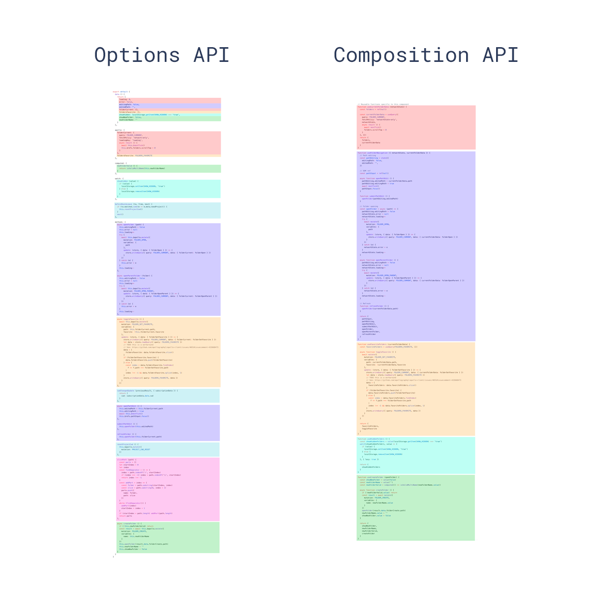
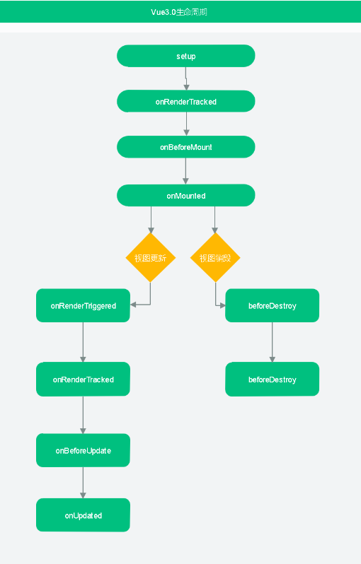

官方
[vue3-beta源码](https://github.com/vuejs/vue-next)
[Vue RFCs](https://github.com/vuejs/rfcs)

[composition-api手册](https://composition-api.vuejs.org/zh/api.html)
[Vue3最新的Beta版本-文档](https://v3.vuejs.org/guide/installation.html)

[vue3模板编译在线体验](https://vue-next-template-explorer.netlify.app/)

文章
[抄笔记：尤雨溪在Vue3.0 Beta直播里聊到了这些…](https://juejin.im/post/5e9f6b3251882573a855cd52)
[尤雨溪在Vue3.0 Beta直播同步更新 | Vue3新特性一篇搞懂](https://juejin.im/post/5e6388366fb9a07cda097c47)
[Vue3 究竟好在哪里？（和 React Hook 的详细对比）](https://juejin.im/post/5e9ce011f265da47b8450c11)
[尤大Vue3.0直播虚拟Dom总结(和React对比)](https://juejin.im/post/5e9faa8fe51d4546fe263eda)

[深入理解 Vue3 Reactivity API](https://zhuanlan.zhihu.com/p/146097763)

[Vue3生态技术内幕](https://www.yuque.com/woniuppp/vue3/intro)

[vue 3.x 如何有惊无险地快速入门](https://juejin.im/post/5ec537486fb9a047bb6a4204)

# Vue3新特性

## 六大亮点
* Performance：性能更比Vue 2.0强。
* Tree shaking support：可以将无用模块“剪辑”，仅打包需要的。
* Composition API：组合API
* Fragment, Teleport, Suspense新组件：“碎片”，Teleport即Protal传送门，“悬念”
* Better TypeScript support：更优秀的Ts支持
* Custom Renderer API：暴露了自定义渲染API

### Performance
* 重写了虚拟Dom的实现（且保证了兼容性，脱离模版的渲染需求旺盛）。
* 编译模板的优化。
* 更高效的组件初始化。
* update性能提高1.3~2倍。
* SSR速度提高了2~3倍。

### Tree shaking support
* 可以将无用模块“剪辑”，仅打包需要的
* 一个简单“HelloWorld”大小仅为：13.5kb
  * 使用Composition API，仅11.75kb，
* 包含运行时完整功能：22.5kb
  * 拥有更多的功能，却比Vue 2更迷你。

```js
<!-- vue 2.x -->
import Vue from 'vue'

<!-- vue 3.x -->
import {ref,computed} from 'vue'
```

### Composition API
* 可与现有的 Options API一起使用
* 灵活的逻辑组合与复用
* vue 3的响应式模块可以和其他框架搭配使用

混入(mixin) 将不再作为推荐使用， Composition API可以实现更灵活且无副作用的复用代码。

### Fragment、\<Teleport>、
Fragment 碎片
* 不再限于模板中的单个根节点
* render 函数也可以返回数组了，类似实现了 React.Fragments 的功能 

\<Teleport> 传送门

* 旨在在当前组件之外呈现某些内容。这也是这是处理模态框、弹出窗口和通常显示在页面顶部的组件的一种非常好的方法。
* 原称为\<Portal>，因为Chrome有个提案，会增加一个名为Portal的原生element，为避免命名冲突，改为Teleport


\<Suspense> 悬念
* 可在嵌套层级中等待嵌套的异步依赖项
* 支持async setup()
* 支持异步组件


### 更好的TypeScript支持
* Vue 3是用TypeScript编写的库，可以享受到自动的类型定义提示
* JavaScript和TypeScript中的API是相同的。
* 支持TSX

### Custom Renderer API：自定义渲染器API
可以在其他平台扩展
[感兴趣可以看这里](https://vugel.planning.nl/#application)

### vite
 [vite-github](https://github.com/vitejs/vite)

一个简易的http服务器，无需webpack编译打包，根据请求的Vue文件，直接发回渲染，且支持热更新（非常快）

# Vue3使用

## 基本
Vue2.x 使用 Options API   
Vue3 使用 Composition API（组合API）



体验
vue-cli
>vue create vue3 (vue-cli4版本)
>vue add vue-next 

vite
>npm init vite-app \<project-name>


基本使用
```js
import { createApp, createComponent } from 'vue'
// 根组件
const App = createComponent({
  components: { Counter },
  template: `
      <div class="container">
          <h3>计数器示例</h3>
          <Counter />
      </div>
  `
})
```
## 全局API 挂载到了app实例上
v3.x 调用createApp返回一个新的vue实例
```js
import { createApp } from 'vue'
const app = createApp()
```

|2.x Global API| 3.x Instance API(app)
|:--|:--
|Vue.config | app.config
|Vue.config.productionTip| 已移除
|Vue.config.ignoredElements|app.config.isCustomElement
|Vue.component|app.component
|Vue.directive|app.directive
|Vue.mixin|app.mixin
|Vue.use|app.use


## Vue3常用API
```js
import {
  createApp,
  ref, // 创建一个响应式的数据对象
  reactive, // 创建响应式数据对象
  toRefs, // 将响应式数据对象转换为单一响应式对象
  isRef, // 判断某值是否是引用类型
  computed, // 创建计算属性
  watch, // 创建watch监听
  getCurrentInstance, // 当前组件的实例
  // 生命周期钩子
  onBeforeMount,
  onMounted,
  onBeforeUpdate,
  onUpdated,
  onBeforeUnmount,
  onUnmounted,
  onErrorCaptured,
  onRenderTracked,
  onRenderTriggered,
} from 'vue'

```

## [生命周期](/src/components/lifeCycle/index.vue)

* 2.x生命周期选项和Composition API之间的映射
* beforeCreate -> 使用 setup()
* created -> 使用 setup()
* beforeMount -> onBeforeMount
* mounted -> onMounted
* beforeUpdate -> onBeforeUpdate
* updated -> onUpdated
* beforeDestroy -> onBeforeUnmount
* destroyed -> onUnmounted
* errorCaptured -> onErrorCaptured
* onRenderTracked, 新增
* onRenderTriggered, 新增
两个新增的钩子都接收DebuggerEvent类似于onTrack和onTrigger观察者的选项：


生命周期调用顺序 
```js
// 创建
setup ->
onRenderTracked ->
onBeforeMount ->
onRenderTracked ->
onMounted ->
onRenderTriggered  ->
onRenderTracked  ->
onBeforeUpdate  ->
onUpdated  ->

// 更新
onRenderTriggered ->
onRenderTracked  ->
onBeforeUpdate ->
onUpdated ->

// 销毁
旧 onBeforeUnmount  ->
新 setup  ->
新 onRenderTracked ->
新 onBeforeMount  ->
旧 onUnmounted  ->
新 onMounted  ->
```





## [setup()](/src/components/setup/index.vue)
* setup 是 vue3 中统一的入口函数,所有生命周期函数定义都是需要定义在次函数下才生效
* setup函数会在 beforeCreate之后 created之前执行
* setup 函数中无法访问到 this
* setup创建组件实例时，在初始道具解析后立即调用。在生命周期方面，它在beforeCreate挂接之前被调用。
* setup接受两个参数，第一个参数是props(默认是响应式)， 另一个参数是context(包含attrs, slots, emit)，
* return 返回一个对象,返回数据和方法

```js
setup(props,context){
  //组件参数 上下文对象
  console.log(props,context)// {attrs, slots, emit}
} 
```

## [ref、reactive、isRef 、toRefs ](/src/components/reactive/index.vue)
* ref : 创建一个响应式的数据对象 ,通过 .value 获取值,主要是对String,Number,Boolean等基本类型的数据响应
* reactive: 创建响应式数据对象 ,可以观察多个属性//相当于2.x的Vue.observable()
* readonly: 设置为只读
* toRefs: 可以将 reactive 创建的可观察对象中的属性都转换成可观察的 Ref 对象，这样一来，即使解构后，也可以被独立进行观察了。
* toRef： 将 reactive 创建的对象的某个属性展开为ref
* unref: 如果参数是一个 ref 则返回它的 value，否则返回参数本身。它是 val = isRef(val) ? val.value : val 的语法糖。
* isRef: 检查值是否是 ref 生成的响应式数据对象
* isProxy: 检查对象是否是由reactive或readonly创建的
* isReactive: 检查值是否是 reactive 生成的响应式数据对象
* isReadonly: 检查值是否是 只读

```html
为什么将可观察对象中的属性解构出来后，变成不再可观察了呢？因为通过 reactive 函数创建的可观察对象，内部的属性本身并不是可观察类型的，对他们访问和观察其实都是通过Proxy代理访问来实现的。如果将这些属性解构，这些属性就不再通过原对象的代理来访问了，就无法再进行观察。
```

[`高级响应式系统API`](https://composition-api.vuejs.org/zh/api.html#%E9%AB%98%E7%BA%A7%E5%93%8D%E5%BA%94%E5%BC%8F%E7%B3%BB%E7%BB%9F-api)
* customRef: 用于自定义一个 ref
* markRaw: 显式标记一个对象为“永远不会转为响应式代理”，函数返回这个对象本身
* shallowReactive: 只为某个对象的私有（第一层）属性创建`浅层`的响应式代理
* shallowReadonly: 只为某个对象的自有（第一层）属性创建`浅层`的只读响应式代理
* shallowRef: 创建一个 ref ，将会追踪它的 .value 更改操作，但是并不会对变更后的 .value 做响应式代理转换（即变更不会调用 reactive）
* toRaw: 返回由 reactive 或 readonly 方法转换成响应式代理的普通对象


## [computed](/src/components/computed/index.vue)

## [watch，watchEffect](/src/components/watch/index.vue)
* watch : 创建 watch 监听
* watchEffect : 如果响应性的属性改变，就会触发这个函数

## [getCurrentInstance](/src/components/getCurrentInstance/index.vue)
当前组件的实例

## [props、emit](/src/components/props-emit/index.vue)

## [provide、inject](/src/components/provide-inject/index.vue)

## [router,route](/src/components/router/index.vue)

### 获取路由
```js
import { useRouter, useRoute } from 'vue-router'

let router = useRouter() // 路由功能函数，push,replace等方法
let route = useRoute() // 路由信息参数，path，params等路由参数
```

getCurrentInstance也可以获取 router 
```js
import { getCurrentInstance } from 'vue'

export default {
  setup () {
    const { ctx } = getCurrentInstance()
    console.log(ctx.$router.currentRoute.value)
  }
}
```

### router-link改变

router-link 添加 scoped-slot  API 和 custom 属性，并移除了 tag 属性和 event 属性。

添加 scoped-slot 有什么用呢？以前只能通过 active-class 来改变元素样式的，现在有了 scoped-slot 之后，我们就更加灵活了，可以根据 scoped-slot 回传的状态自定义，不管是样式还是类。
```html
<router-link to="/" custom v-slot="{ href, navigate, isActive }">
  <div :class="{ 'active': isActive }">
    <p>{{href}}</p> <!-- / -->
    <p>{{navigate}}</p> <!-- function navigate(e = {}) {....} -->
    <p>{{isActive}}</p> <!-- false -->
    <a :href="href" @click="navigate">Home</a>
  </div>
</router-link>
```


### hash,history路由模式
v2
```js
{
  mode: 'hash'
  mode: 'history'
}
```

v3
```js
import { 
  createRouter,
  createWebHashHistory 
  // createWebHistory
} from 'vue-router';

const router = createRouter({
  history: createWebHashHistory (process.env.BASE_URL), // hash路由
  // history: createWebHistory(process.env.BASE_URL), // history路由
  [
    // ...
  ]
})
```

### 路由匹配所有
```js
{
  // vue2为  *
  path: '/:catchAll(.*)',
  name: '404',
  component: () => import(/* webpackChunkName: "404" */ '@/views/404.vue')
}
```

### 动态路由
新增方法
* router.addRoute(route: RouteRecord) 动态添加路由
* router.removeRoute(name: string | symbol)，动态删除路由
* router.hasRoute(name: string | symbol): boolean ，判断路由是否存在
* router.getRoutes(): RouteRecord[] 获取路由列表

[详情可见](https://github.com/vuejs/rfcs/blob/master/active-rfcs/0029-router-dynamic-routing.md)

## [vuex](/src/components/store/index.vue)
```js
import { useStore } from 'vuex'

const store = useStore()
```

getCurrentInstance也可以获取 store 
```js
import { computed, getCurrentInstance } from 'vue'

export default {
  setup () {
    const { ctx } = getCurrentInstance()
    const isLogin = computed(() => ctx.$store.state.isLogin)
    console.log(isLogin);

    const update = () => {
      ctx.$store.commit('update', isLogin)
    }

    return {
      isLogin,
      update
    }
  }
}
```

## [如何逻辑复用,替代mixins](/src/components/mixins/index.vue)
在vue2当中,如果我们想要复用逻辑，通常都是采用mixins来导入需要的函数方法，
单有很多的缺点，例如:
* 渲染上下文中公开的属性的来源不清楚。 例如，当使用多个 mixin 读取组件的模板时，可能很难确定从哪个 mixin 注入了特定的属性。
* 命名空间冲突。 mixins 可能会在属性和方法名称上发生冲突，

在vue3 利用CompositionAPI，通过在公用js导出，需要时 按需引入即可

## 其他 import方法


## v-model
```html
<input :modelValue="pageTitle" @update:modelValue="pageTitle = $event">
```

## [一个标签组件使用多个v-model](/src/components/others/vModels/index.vue)
```js
<my-com
  v-model:name="name"
  v-model:email="email"
/>
```

例子:

parent.vue
```html
<template>
  <div>
    <input v-model="name">
    <input v-model="email">
    <my-com
      v-model:name="name"
      v-model:email="email"
    />
  </div>
</template>

<script>
import myCom from './B.vue'
import { toRefs, reactive } from 'vue'
export default {
  components:{
    myCom
  },
  setup(){
    let state = reactive({
      name: 'tom',
      email: 'a@b.com'
    })
    return {
      ...toRefs(state)
    }
  }
}
</script>
<style lang="less">
  .confirm-modal{
    background-color: #fff;
  }
  #app{
    height: 1000px;
  }
</style>
```

child.vue
```html
<template>
<!--  -->
<div>
  <p>姓名：{{name}}</p>
  <p>邮箱：{{email}}</p>
</div>
</template>
<script>
export default {
  props: ['name','email'],
};
</script>
```


### 去掉了 .sync ，合并到了 v-model 里
```html
<!-- vue 2.x -->
<my-com v-bind:title.sync="title" />

<!-- vue 3.x -->
<my-com v-model:title="title" />

```


## 全局组件注册
v2.x
```js
Vue.component('组件名',com)
```

v3.x
```js
const app = createApp(App)
app.component('组件名',com)
```


## 函数式组件
\<template functional> 不再支持
  >在3.x中，有状态组件和功能组件之间的性能差异已大大减少，在大多数使用情况下将不明显

函数式组件必须写成函数

```js
<!-- vue 2.x -->
const FunctionalComp = {
  functional: true,
  render(h) {
    return h('div', `Hello! ${props.name}`)
  }
}
    
<!-- vue 3.x -->
import { h } from 'vue'
const FunctionalComp = (props, { slots, attrs, emit }) => {
  return h('div', `Hello! ${props.name}`)
}

```

## 异步组件
由于组件被定义为纯函数，我们需要引入defineAsyncComponent实现异步

[更多详情](https://github.com/vuejs/rfcs/blob/master/active-rfcs/0026-async-component-api.md)
```js
// v2.x
const Home = () => import('./Home.vue')

// with options
const Home = () => ({
  component: import('./Home.vue'),
  loading: LoadingComponent,
  error: ErrorComponent,
  delay: 200,
  timeout: 3000
})

// v3.x
import { defineAsyncComponent } from 'vue'
const Home = defineAsyncComponent(() => import('./Home.vue'))

// with options
const Home = defineAsyncComponent({
  loader: () => import("./Home.vue"),
  loadingComponent: LoadingComponent,
  errorComponent: ErrorComponent,
  delay: 200,
  timeout: 3000
})
```

## render 渲染API
v2.x
```js
export default {
  render(h) {
    return h('div','hello world')
  }
}
```

v3.x

h 函数全局导入，而不是传递给渲染函数作为参数
```js
import { h } from 'vue'
export default {
  render() {
    return h('div','hello world')
  }
}
```


## 自定义指令
v2.x 钩子函数
```js
const MyDirective = {
  bind(el, binding, vnode, prevVnode) {},
  inserted() {},
  update() {},
  componentUpdated() {},
  unbind() {}
}
Vue.directive('MyDirective', MyDirective)
```


v3.x
```js
const MyDirective = {
  beforeMount(el, binding, vnode, prevVnode) {},
  mounted() {},
  beforeUpdate() {},
  updated() {},
  beforeUnmount() {},
  unmounted() {}
}

const app = Vue.createApp({})
app.directive('MyDirective', MyDirective)
```

## Fragments 碎片
vue2创建一个Vue组件，只能有一个根节点

这意味着无法创建这样的组件：
```vue
<template>
  <div>Hello</div>
  <div>World</div>
</template>
```
原因是代表任何Vue组件的Vue实例都需要绑定到单个DOM元素中。  
创建具有多个DOM节点的组件的唯一方法是通过创建不具有基础Vue实例的功能组件。

vue3 
* 不再限于模板中的单个根节点
* render 函数也可以返回数组了，类似实现了 React.Fragments 的功能 

意义
* 减少无意义的div
* 组件递归，可以实现平级递归，不会有多余的div了 这个在以后实现虚拟列表，tree组件的时候意义重大


## Teleport
\<Teleport\>原先是对标 React Portal（增加多个新功能，更强）

但因为Chrome有个提案，会增加一个名为Portal的原生element，为避免命名冲突，改为Teleport

Teleport是特殊的组件，旨在在当前组件之外呈现某些内容。这也是这是处理模态框、弹出窗口和通常显示在页面顶部的组件的一种非常好的方法。

通过使用Portals，您可以确保没有任何主机组件CSS规则，会影响您要显示的组件，并使您免于使用进行讨厌的黑客攻击

vue2需通过portal-vue库实现

```html
<template>
<div class="confirm-modal">
  <button @click="isOpen = true">打开</button>
  <!-- 注意这一块代码 -->
  <Teleport to="#foot-container">
    <div v-if="isOpen">
      <p>底部信息底部信息底部信息底部信息底部信息底部信息</p>
      <button @click="isOpen = false">取消</button>
    </div>
  </Teleport>
</div>
</template>
<script>
import {ref} from 'vue'
export default {
  setup(){
    const isOpen = ref(false)
    return {isOpen}
  }
}
</script>
```

[更多详情](https://github.com/vuejs/rfcs/blob/master/active-rfcs/0025-teleport.md)

## Suspense组件
* 可在嵌套层级中等待嵌套的异步依赖项
* 支持async setup()
* 支持异步组件

加载异步组件，在异步组件加载完成成并完全渲染之前 suspense 会先显示 #fallback 插槽的内容 。
```html
<Suspense>
  <template #default>
    异步的组件
  </template>
  <template #fallback>
    加载状态的组件
  </template>
</Suspense>
```

